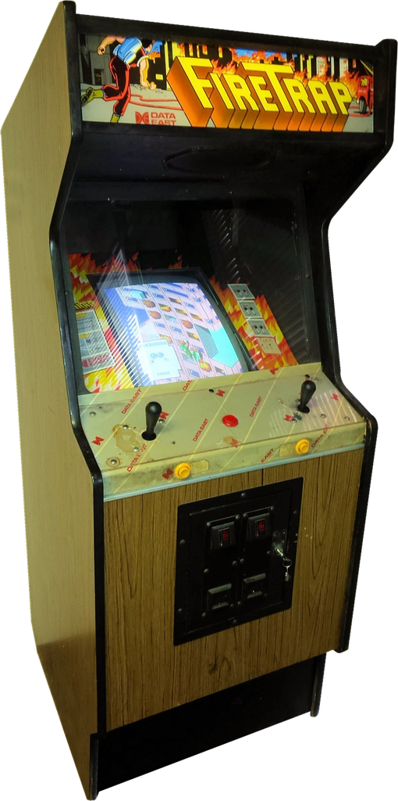
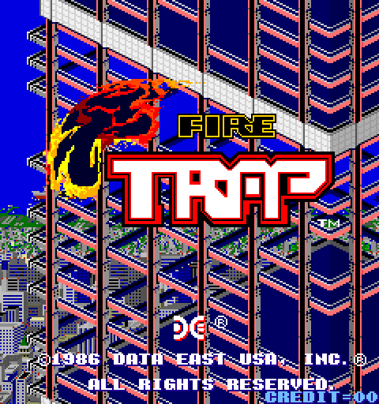

# Fire Trap (Arcade, 1986) for MiSTer FPGA

An FPGA implementation of Wood Place's **Fire Trap** (licensed in the US by Data East) for the
[MiSTer FPGA](https://github.com/MiSTer-devel/Main_MiSTer/wiki) platform.

A burning skyscraper and a firefighter with a hose: climb the building hand over hand, Crazy
Climber style, and put out the fires on your way to the top.

<p align="center">
  
  
</p>

> **Early build.** Playable and tested on MiSTer over HDMI; a few issues are still being worked
> on (below). Feedback and bug reports are welcome via
> [Issues](https://github.com/Usquebagh/Arcade-FireTrap_MiSTer/issues).

## Known issues

- **Sound effects can stop:** sometimes only the music keeps playing and the sound effects go
  silent, e.g. on stage 2 (seen without cheats). With the *Infinite Time* cheat on it happens
  reliably after a stage clear: the music for the descent keeps playing into the next stage.
- **End-of-stage bonus shows wrong digits:** after the landing sequence, the score tally can show
  values that are not proper decimal numbers (they look like hex).

Both are being investigated.

---

## Original Hardware

| Subsystem | Original Hardware | FPGA Implementation |
|---|---|---|
| **Main CPU** | Zilog Z80B @ 6 MHz | T80 |
| **Protection MCU** | Intel 8751 @ 8 MHz (coins, and data the game fetches at boot) | jt8051 (Jose Tejada), running the original MCU program |
| **Sound CPU** | MOS 6502 @ 1.5 MHz | Arlet Ottens' verilog-6502 |
| **Sound** | Yamaha YM3526 (OPL) + OKI MSM5205 ADPCM | jtopl, jt5205 (Jose Tejada) |
| **Video** | Text layer, two scrolling 16×16 tile layers, 96 sprites, priority and palette PROMs, DECO custom chips | `ft_video.v`, `ft_render.v`, from the schematics |
| **Display** | 256 × 240, vertical (ROT90), 57.4 Hz | Rotated with the MiSTer framebuffer; graphics ROMs in SDRAM |
| **Controls** | Two 4-way joysticks and one button per player | D-pad / analog sticks, or single-stick mode |

Notes on the hardware and design decisions are in [docs/hardware.md](docs/hardware.md).

---

## Controls

The arcade panel has **two 4-way joysticks**, one for each hand, and one red **PUSH** button.

| Action | On the arcade sticks |
|---|---|
| **Climb up** | Hand over hand, as in Crazy Climber: *left up + right down*, then *left down + right up*, and repeat. Pushing both sticks up does nothing. |
| **Move sideways** | Both sticks left, or both sticks right |
| **Spray water** | The **Fire** button |
| **High-score initials** | The **Fire** button is needed to enter them |

On a MiSTer pad:

| Input | Function |
|---|---|
| **D-Pad** or **Left Analog** | Left stick |
| **Right Analog**, or **X / B / Y / A** | Right stick (up / down / left / right) |
| **R** | Fire |
| **Start** | Start |
| **Select** | Coin |

The left analog stick always works as the left stick and the right analog stick as the right
one; MiSTer's *Define joystick buttons* only asks for the d-pad and the buttons above.

### Single Stick mode

The original game needs two joysticks, so this core adds its own **Single Stick** mode for
playing with one joystick or a d-pad. Set **Joysticks → Single Stick** in the OSD:

| Input | Function |
|---|---|
| **Up** (hold) | Climb: the core alternates the hands for you |
| **Left / Right** | Move sideways |
| **Down** | Both sticks down |
| **R** | Fire |

**Single Stick Climb** sets how often the hands swap: 24 frames (default), 16, 32 or 40.

**4-Way Filter** (on by default) keeps diagonals out, as the original 4-way sticks did.

---

## OSD options

| Option | Notes |
|---|---|
| Orientation | Vertical (rotated, for a horizontal screen) or Horizontal (for a rotated monitor) |
| Joysticks / Single Stick Climb / 4-Way Filter | See *Controls* |
| DIP switches | Coinage, cabinet, demo sound, flip screen, difficulty, lives, bonus life, continue, service (test) mode |
| Cheats | See below |
| Advanced → Z80 VRAM Wait | *On (Board)*: the Z80 waits for blanking when it touches tile RAM, as the schematics show. *Off (MAME)*: no waits, as in MAME. |
| Advanced → SDRAM Read Phase | Leave at **2.5**. Only for troubleshooting garbled graphics. |

**Service mode:** set the *Service Mode* DIP switch On and reset; set it Off and reset to return
to the game.

**Cheats** (OSD **Cheats** menu): P1/P2 Infinite Lives, P1/P2 Infinite Time and the 3-Way
Powerup, converted from the MAME cheat file. Like MAME's, they write the value into RAM once per
frame. *Infinite Time* reliably triggers the sound issue in [Known issues](#known-issues).

---

## ROMs

```
ROMs are not included. Use the MAME "firetrap" set (merged, MAME 0.289).

/_Arcade/Fire Trap (US, rev A).mra
/_Arcade/Fire Trap (US).mra
/_Arcade/Fire Trap (Japan).mra
/_Arcade/cores/FireTrap_YYYYMMDD.rbf
/games/mame/firetrap.zip
```

The bootleg `firetrapbl` is not supported.

---

## Compilation

Quartus Prime Lite 17.0 targeting the DE10-Nano's Cyclone V. Open `Arcade-FireTrap.qpf` and
compile, or run `./build.sh` to build in Docker. A Verilator simulation, with tools to compare
frames and audio against MAME, is in `sim/`.

---

## Credits

- **Fire Trap (Arcade):** Wood Place, 1986; licensed in the US by Data East USA
- **T80 (Z80):** Daniel Wallner and contributors
- **jt8051, jtopl, jt5205:** Jose Tejada (jotego), from [jtcores](https://github.com/jotego/jtcores)
- **6502 CPU:** Arlet Ottens
- **SDRAM controller:** Sorgelig
- **Cheat engine:** based on Kitrinx's MiSTer cheat code handling, via Martin Donlon's Irem M92 core
- **Cheats:** converted from the MAME cheat file at [mamecheat.co.uk](https://www.mamecheat.co.uk)
- **Reference:** MAME `firetrap` driver by Nicola Salmoria and Stephane Humbert, and the
  schematics in the Data East installation & service manual
- **MiSTer Platform:** Sorgelig and the MiSTer community

## License

GPL-3.0. See individual source files for their respective licenses.
